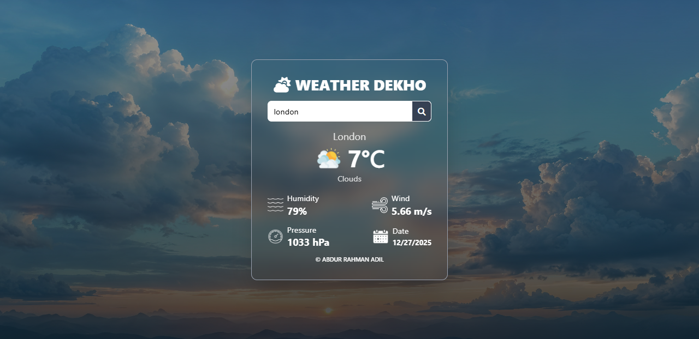

# Weather Dekho 🌤️

A modern, responsive weather application that provides real-time weather information for any city worldwide. Built with HTML, CSS, and JavaScript, featuring a beautiful UI with smooth animations.



## ✨ Features

- **Real-time Weather Data**: Get current weather conditions for any city
- **Beautiful UI**: Modern glassmorphism design with smooth animations
- **Responsive Design**: Works perfectly on desktop and mobile devices
- **Detailed Information**:
  - Temperature in Celsius
  - Weather conditions (Clouds, Clear, Rain, etc.)
  - Humidity percentage
  - Wind speed
  - Atmospheric pressure
  - Current date
- **Dynamic Icons**: Weather condition-based image updates
- **Error Handling**: User-friendly error messages
- **Loading States**: Smooth loading animations

## 🚀 Live Demo

🔗 **[Try it here](https://your-deployed-link.com)** *(Replace with your actual deployment link)*

## 📸 Preview

<div align="center">
  
  
  
</div>

## 🛠️ Technologies Used

### Frontend
- **HTML5** - Semantic markup
- **CSS3** - Modern styling with Tailwind-inspired classes
- **JavaScript (ES6+)** - Dynamic functionality and API integration
- **Font Awesome** - Icon library

### API Integration
- **OpenWeatherMap API** - Weather data provider

### Design Features
- Glassmorphism effect
- Responsive grid layout
- Smooth transitions and animations
- Color-coded weather indicators

## 📁 Project Structure

```
weather-dekho/
│
├── index.html          # Main HTML file
├── src/
│   ├── style.css       # Custom CSS styles
│   ├── app.js          # Main JavaScript file
│   └── assets/
│       └── images/     # Weather condition icons
│           ├── clouds.png
│           ├── clear.png
│           ├── rain.png
│           ├── drizzle.png
│           ├── mist.png
│           ├── snow.png
│           ├── humidity.png
│           ├── wind.png
│           ├── pressure.png
│           └── date.png
│
└── README.md          # Project documentation
```

## 🔧 Installation & Setup

### Prerequisites
- A modern web browser
- Internet connection
- OpenWeatherMap API key (free tier available)

### Steps to Run Locally

1. **Clone the repository**
   ```bash
   git clone https://github.com/SyntaxAdil/weather-dekho.git
   cd weather-dekho
   ```

2. **Get API Key**
   - Visit [OpenWeatherMap](https://openweathermap.org/api)
   - Sign up for a free account
   - Generate an API key
   - Replace the API key in `app.js`:
     ```javascript
     // Line 42 in app.js
     let apiKey = "&appid=YOUR_NEW_API_KEY&units=metric";
     ```

3. **Run the Application**
   - Simply open `index.html` in your browser
   - Or use a local server:
     ```bash
     # Using Python
     python -m http.server 8000
     
     # Using Node.js with http-server
     npx http-server
     ```

## 📖 How to Use

1. **Enter City Name**
   - Type the name of any city in the search box
   - Press Enter or click the search button

2. **View Weather Information**
   - See the current temperature in Celsius
   - Check weather conditions with appropriate icons
   - View detailed metrics (humidity, wind, pressure)
   - Note the current date

3. **Features**
   - Responsive design for all screen sizes
   - Dynamic weather images based on conditions
   - Error handling for invalid cities
   - Loading animation during API calls

## 🌐 API Integration

The app uses **OpenWeatherMap API** with the following endpoints:

```javascript
const apiUrl = "https://api.openweathermap.org/data/2.5/weather?q=";
const apiKey = "&appid=YOUR_API_KEY&units=metric";
```

### Weather Conditions Supported
- ☁️ **Clouds** - `d.weather[0].main === "Clouds"`
- ☀️ **Clear** - `d.weather[0].main === "Clear"`
- 🌧️ **Rain** - `d.weather[0].main === "Rain"`
- 🌦️ **Drizzle** - `d.weather[0].main === "Drizzle"`
- 🌫️ **Mist** - `d.weather[0].main === "Mist"`
- ❄️ **Snow** - `d.weather[0].main === "Snow"`

## 🎨 Customization

### Changing Colors
Modify the CSS variables in `style.css`:
```css
:root {
  --primary-bg: linear-gradient(to bottom right, #000000, #000000b3);
  --card-bg: #1f2937;
  --text-color: #ffffff;
}
```

### Adding New Weather Conditions
Extend the `changeImage()` function:
```javascript
else if (d.weather[0].main === "Thunderstorm") {
  weatherConditionImage.src = "./src/assets/images/thunderstorm.png";
}
```

## 🤝 Contributing

Contributions are welcome! Here's how you can help:

1. **Fork the repository**
2. **Create a feature branch**
   ```bash
   git checkout -b feature/AmazingFeature
   ```
3. **Commit your changes**
   ```bash
   git commit -m 'Add some AmazingFeature'
   ```
4. **Push to the branch**
   ```bash
   git push origin feature/AmazingFeature
   ```
5. **Open a Pull Request**

### Areas for Improvement
- [ ] Add 5-day forecast
- [ ] Implement geolocation for current location
- [ ] Add temperature unit toggle (Celsius/Fahrenheit)
- [ ] Include sunrise/sunset times
- [ ] Add dark/light mode toggle
- [ ] Implement city favorites/bookmarks
- [ ] Add weather charts and graphs

## 📄 License

This project is licensed under the MIT License - see the [LICENSE](LICENSE) file for details.

## 👨‍💻 Author

### **Md. Abdur Rahman Adil**
- 📧 Email: [abdurrahmanadil005@gmail.com](mailto:abdurrahmanadil005@gmail.com)
- 💼 GitHub: [@SyntaxAdil](https://github.com/SyntaxAdil)
- 🔗 Portfolio: [Your Portfolio Link](#)
- 🐦 Twitter: [@YourTwitterHandle](#)

## 🙏 Acknowledgments

- **OpenWeatherMap** for providing the weather data API
- **Font Awesome** for the beautiful icons
- **Tailwind CSS** for design inspiration
- **All contributors** who have helped improve this project

## 🐛 Troubleshooting

### Common Issues

1. **API Key Not Working**
   - Ensure you've replaced the placeholder API key
   - Verify your OpenWeatherMap account is active
   - Check API usage limits

2. **City Not Found**
   - Verify spelling of the city name
   - Try adding country code (e.g., "London,GB")

3. **Images Not Loading**
   - Check image paths in the `src/assets/images/` directory
   - Ensure filenames match exactly in the `changeImage()` function

4. **Cross-Origin Issues**
   - Run the app through a local server, not directly from file system

## 🌟 Show Your Support

If you like this project, please give it a ⭐ on [GitHub](https://github.com/SyntaxAdil/weather-dekho)!

---

<div align="center">
  
**Made with ❤️ by Md. Abdur Rahman Adil**

[](https://github.com/SyntaxAdil)
[](mailto:abdurrahmanadil005@gmail.com)

</div>